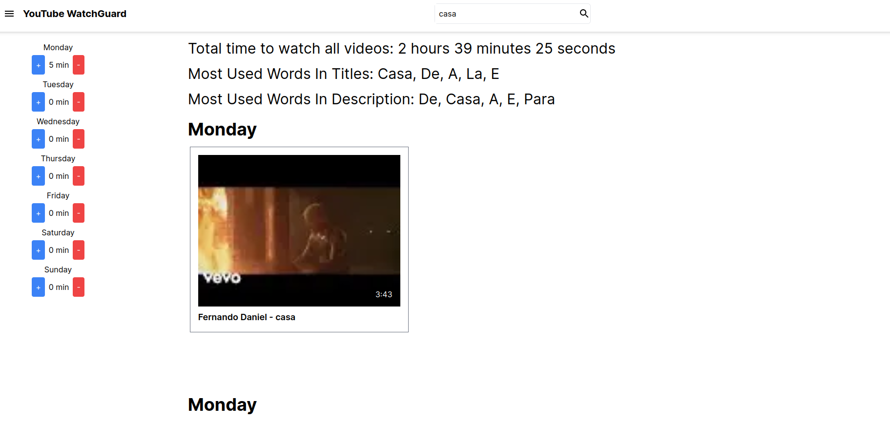

# Bem vindo(a) ao Youtube WatchGuard



Para acessar o frontend implantado, basta visitar:  https://youtube-watchguard.vercel.app

Para interagir com o backend implantado, o frontend faz solicitações para: https://youtube-watchguard-server.fly.dev

O Youtube WatchGuard é um projeto desenvolvido para monitorar e controlar o acesso a vídeos do YouTube. Ele consiste em um servidor e uma interface web que trabalham em conjunto para proporcionar um controle refinado sobre o que os usuários podem assistir na plataforma YouTube.

## Implantação

O Youtube WatchGuard é implantado em dois ambientes diferentes: a Vercel e a Fly.io.

### Frontend - Vercel
O frontend O Youtube WatchGuard é implantado na Vercel, uma plataforma de hospedagem que oferece implantações rápidas e escaláveis para aplicativos da web. A Vercel simplifica o processo de implantação e hospedagem, permitindo que você se concentre mais no desenvolvimento do aplicativo em si.

OBS: Foi necessário adicionar o prefixo `NEXT_PUBLIC` nas variaveis de ambiente

### Backend - Fly.io
O backend O Youtube WatchGuard é implantado na Fly.io, uma plataforma que fornece implantação global para aplicativos. A Fly.io permite que você implante seu aplicativo em vários data centers ao redor do mundo, melhorando o desempenho e a confiabilidade.

## Funcionalidades

- **Controle de Acesso**: O Youtube WatchGuard permite que os administradores controlem quais vídeos do YouTube os usuários têm permissão para assistir. Isso é particularmente útil em ambientes educacionais, familiares ou corporativos, onde é importante filtrar o conteúdo que os usuários podem acessar.

- **Interface Web Intuitiva**: A interface web oferece uma maneira amigável de configurar as restrições de acesso. Os administradores podem criar listas de permissões, listas de bloqueios e ajustar as configurações de restrição com facilidade.

## Documentação

A documentação do Youtube WatchGuard está dividida em duas partes principais: a documentação do servidor e a documentação da interface web.

- [Documentação do Servidor](/server/README.md): Esta seção contém informações detalhadas sobre como configurar e executar o servidor do Youtube WatchGuard. Descreve os requisitos do sistema, as dependências, as etapas de instalação e as opções de configuração disponíveis.

- [Documentação da Interface Web](/web/README.md): Aqui, você encontrará instruções sobre como configurar e usar a interface web do Youtube WatchGuard. Descreve os requisitos do sistema, as dependências, as etapas de instalação e as opções de configuração disponíveis.


## Rodando aplicação

Siga as instruções abaixo para instalar e configurar o Youtube WatchGuard:
1. Clone este repositório: `git clone https://github.com/Thierryvil/youtube-watchguard.git`
2. Navegue até a pasta da aplicação `cd youtube-watchguard`
   

### Localmente

3. Navegue até a pasta do servidor: `cd server`
4. Siga as instruções na [Documentação do Servidor](/server/) para configurar e executar o servidor.
5. Navegue até a pasta da interface web: `cd ../web`
6. Consulte a [Documentação da Web](/web/) para configurar a interface web.

### Docker
1. Faça o build do projeto
```sh
docker-compose build --no-cache
```

2. Inice a aplicação
```sh
docker-compose up -d
```